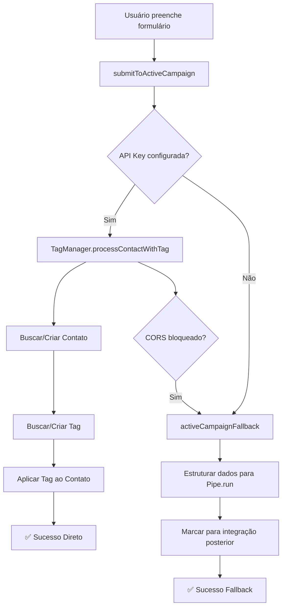

# 🏷️ ActiveCampaign Tag Integration - Fast Homes

## Funcionalidade Implementada

A integração foi aprimorada para aplicar automaticamente a tag **`catalogo-fast-homes-solicitado`** aos contatos que preenchem o formulário.

## Como Funciona

### 1. Integração Direta (Preferencial)
Quando a API Key está configurada:
- ✅ Busca ou cria o contato no ActiveCampaign
- ✅ Busca ou cria a tag `catalogo-fast-homes-solicitado`
- ✅ Aplica a tag instantaneamente ao contato
- ✅ Logs detalhados no console

### 2. Modo Fallback (CORS Bloqueado)
Quando a integração direta falha:
- 📋 Dados estruturados são incluídos no Pipe.run
- 🔗 Tag pode ser aplicada via webhook ou automação
- ⚙️ Funciona mesmo sem API Key configurada

## Configuração

### Passo 1: Obter API Key
1. Acesse sua conta ActiveCampaign
2. Vá em **Settings > Developer**
3. Copie a **API Key**

### Passo 2: Configurar no Código
Edite o arquivo `src/config.js`:

```javascript
const ACTIVE_CAMPAIGN_CONFIG = {
    BASE_URL: 'https://fastdrywall80017.activehosted.com',
    
    // CONFIGURE SUA API KEY AQUI
    API_KEY: 'sua-api-key-aqui',
    
    // ... resto da configuração
    TAG_NAME: 'catalogo-fast-homes-solicitado'
};
```

### Passo 3: Testar Integração
Abra o console do navegador e execute:
```javascript
testarIntegracaoTag();
```

## Arquivos Modificados

### Novos Arquivos
- ✨ `src/activecampaign-tag-manager.js` - Gerenciador de tags
- ✨ `src/teste-integracao-tag.js` - Script de teste
- ✨ `CONFIGURACAO_API_ACTIVECAMPAIGN.md` - Documentação de configuração

### Arquivos Modificados
- 🔧 `src/config.js` - Adicionada configuração de TAG_ID e API_KEY
- 🔧 `src/script.js` - Implementação da aplicação de tags
- 🔧 `index.html` - Carregamento dos novos scripts

## Fluxo de Execução



## Logs no Console

### Sucesso Direto
```
🔄 Tentando integração direta com Active Campaign...
🎯 Iniciando processo: contato usuario@email.com + tag "catalogo-fast-homes-solicitado"
✅ Tag "catalogo-fast-homes-solicitado" encontrada com ID: 123
✅ Contato encontrado: usuario@email.com (ID: 456)
✅ Processo concluído: tag "catalogo-fast-homes-solicitado" aplicada ao contato usuario@email.com
✅ Active Campaign: Integração direta realizada com sucesso!
🎯 Tag "catalogo-fast-homes-solicitado" aplicada ao contato usuario@email.com
```

### Modo Fallback
```
⚠️ Integração direta falhou (CORS ou outro erro), usando fallback...
📋 Dados estruturados para Active Campaign incluídos no Pipe.run
🔗 Para integração automática, configure um webhook ou automação
```

## Benefícios

### ✅ Vantagens da Integração Direta
- Tag aplicada instantaneamente
- Não depende de webhooks externos
- Controle total sobre o processo
- Logs detalhados para debugging
- Criação automática de tags se não existirem

### ✅ Vantagens do Fallback
- Funciona mesmo com CORS bloqueado
- Não requer configuração de API Key
- Dados preservados no Pipe.run
- Compatibilidade garantida

## Troubleshooting

### Problema: Tag não é aplicada
**Verificações:**
1. API Key configurada corretamente?
2. Console mostra erros de CORS?
3. Base URL está correta?

**Soluções:**
```javascript
// Verificar configuração
verificarConfiguracao();

// Testar integração
testarIntegracaoTag();
```

### Problema: CORS bloqueado
**Sintomas:**
- Logs mostram "usando fallback"
- Tag não aplicada instantaneamente

**Soluções:**
1. Configure webhook no Pipe.run
2. Use automação do ActiveCampaign
3. Configure CORS no ActiveCampaign (se possível)

## Configuração de Webhook (Alternativa ao CORS)

Se a integração direta falhar, configure um webhook no Pipe.run para processar os dados do ActiveCampaign:

1. **Pipe.run → Webhooks**
2. **Criar webhook que processa:**
   ```javascript
   if (lead.custom_fields.integration_target === 'active_campaign') {
       // Processar dados do lead.custom_fields.active_campaign_data
       // Aplicar tag via API do ActiveCampaign
   }
   ```

## Status da Implementação

- ✅ **Tag Manager** - Implementado
- ✅ **Integração Direta** - Implementado  
- ✅ **Modo Fallback** - Implementado
- ✅ **Scripts de Teste** - Implementado
- ✅ **Documentação** - Implementado
- ⚙️ **Configuração API Key** - Pendente (usuário)

## Próximos Passos

1. **Configure sua API Key** em `src/config.js`
2. **Teste a integração** com `testarIntegracaoTag()`
3. **Monitore os logs** durante o uso real
4. **Configure webhook** se necessário para fallback

---

> 💡 **Dica:** A tag `catalogo-fast-homes-solicitado` será criada automaticamente se não existir no seu ActiveCampaign.
